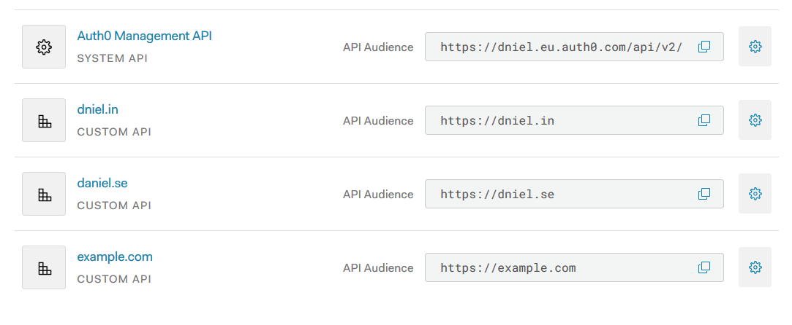
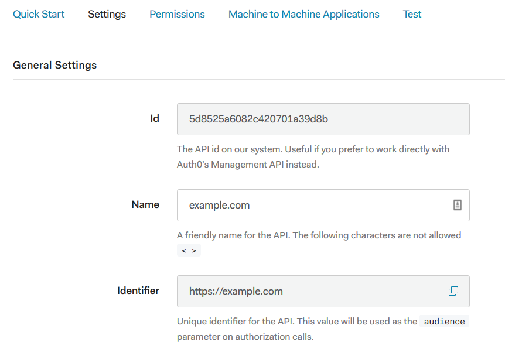
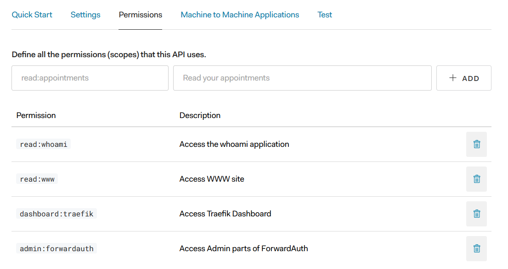
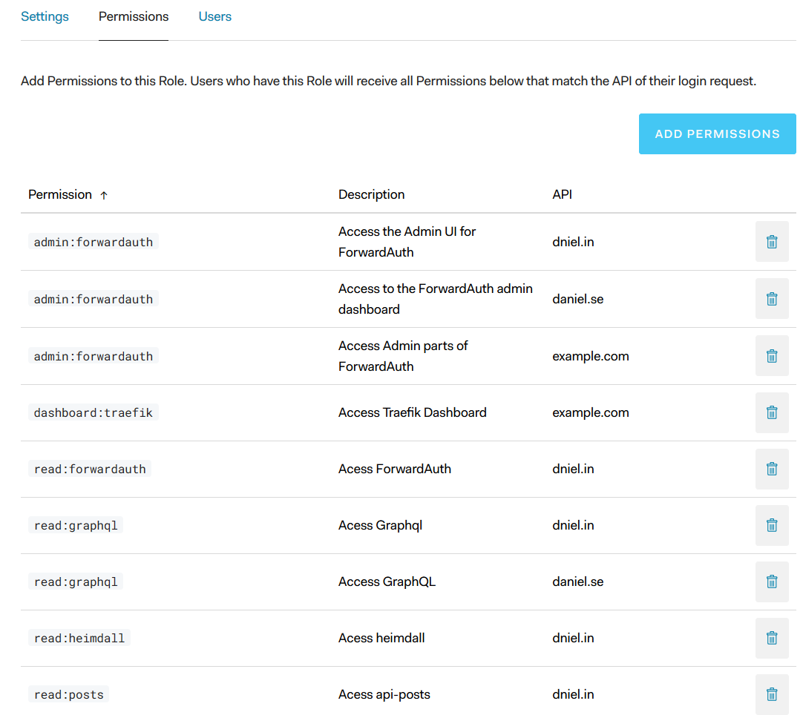

# What is Auth0? 
Quoted from https://auth0.com/docs/getting-started/overview
> Auth0 provides authentication and authorization as a service.
> We are here to give developers and companies the building blocks they need to secure their applications without having 
> to become security experts. You can connect any application (written in any language or on any stack) to Auth0 and define
> the identity providers you want to use (how you want your users to log in). Based on your app's technology, choose one of 
> our SDKs (or call our API), and hook it up to your app. Now each time a user tries to authenticate, Auth0 will verify 
> their identity and send the required information back to your app. 

## Auth0 Central Components
ForwardAuth is built on the following central components from Auth0:
* Authorization Code OAuth 2.0 grant-flow 
* Applications
* APIs
* Role Based Access Control
* Users, Roles and Permissions
* Rules

### Authorization Code OAuth 2.0 grant-flow
ForwardAuth uses the Authorization Code OAuth 2.0 grant-flow to do a redirect exchange of code and retrieve an
access token and user token. Check the [Auth0 Documentation](https://auth0.com/docs/api-auth/grant/authorization-code)
on how this flow works.

*First* when a request is received by the ForwardAuth-backend and it need to authenticate the use, it uses the x-forwarded-host 
to match a application name to the loaded list of apps in the config. If an application is matched the application uses the
client-id, client-secret, scope and audience for that application to request a access token exchange code from Auth0.

*Then* it will validate the Access Token found in the HTTP headers to verify that its a valid and not tampered JWT. 
Because of Auth0 has two different formats for Access Tokens, Opaque and Jwt Token, depending on if the audience 
was set when requesting the token, the only way for ForwardAuth to validate that the Access Token has not been
tampered with and has not expired is if you use a token with JWT format. This means that Auth0 *MUST* be configured
with either and Audience or a Default Audience in the Auth0 Tenant when requesting an Access Token to receive a token
of JWT Format, or else the user will get Access Denied from ForwardAuth because the token could not be verified. 

*Afterwards* it will check if the audience of the Access Token is the same as the one specified for the application matched
in the application config to the forwarded-host to make sure that the application that the token is actually the intended
audience for the http request. If the Access Token is not intended for the current application audience, the user will
be redirected to authorize again with Auth0.

### Application
From the [Auth0 documentation on Applications](https://auth0.com/docs/applications)
> Applications are primarily meant for human interaction, as opposed to APIs, which provide data to applications through 
> a standardized messaging system.
>
> The term application does not imply any particular implementation characteristics. For example, your application could 
> be a native app that executes on a mobile device, a single-page app that executes on a browser, or a regular web app
> that executes on a server.


### API
The [Auth0 documentation on APIs](https://auth0.com/docs/apis) describes an API like this
>An API is an entity that represents an external resource, capable of accepting and responding to protected resource requests 
>made by applications. At the OAuth2 spec an API maps to the Resource Server.
>
>When an application wants to access an API's protected resources it must provide an Access Token. 
>The same Access Token can be used to access the API's resources without having to authenticate again, until it expires.

Register the web applications that you want to protect behind Traefik and ForwardAuth as APIs to be able to add
permissions to them. You can also [represent Multiple APIs Using a Single Logical API in Auth0](https://auth0.com/docs/api-auth/tutorials/represent-multiple-apis)
so that they doesn't need to re-authenticate when navigating between services.



#### Set a unique API identifier for your API.


#### Enable RBAC for the API on the same page
The new system for [Auth0 RBAC](https://auth0.com/docs/authorization) is being released gradually during 2019 to replace 
the current Authorization Extension. 


To use Auth0 RBAC for your API you need to go to the settings of the API and click on the enable switch, and also 
the "Add Permissions to Access Token" so that ForwardAuth can see them in the returned token.
Then under Permissions in your API's settings create permissions for your API. Then go to Users & Roles
and add either directly to a user the permissions you created in your API, or create a role with a set of permissions and
assign to your users.

The RBAC system will run when the user log in and match all the scopes you send in to the permissions of the user.
Any permissions requested by the user that they dont have, will be removed by the RBAC system when returning the response.

If you dont enable RBAC for your API, or dont enable "Add permissions to Access Token" everybody will be 
let through to the API.

#### Add permissions to the API.


#### Assign permissions to Users and Roles
You can assign permissions to Roles and assign roles to your users.



#### Require Permissions to access an application in ForwardAuth
In the application.yaml file for ForwardAuth add a `required-permissions` to assign permissions that ForwardAuth
will check before letting the user access the application. The permissions is transferred on login from Auth0
to ForwardAuth using the Access Token when the Access Token is a JWT Token,  i.e, the audience for an API has been
set. This also means that permissions is only useful for access control to API's. There is no way to assign permissions
to applications in Auth0.

The required-permissions is an Array of permissions and if the user that tries to login and access an application
does not have the required permissions an HTTP 403 Forbidden will be thrown and an error page will be displayed.
E.g, 
```yaml
apps:
  - name: whoami.example.test
    audience: https://whoami.dniel.se
    required-permissions:
      - write:whoami
      - read:whoami
```

### Rules
Quoted from [Auth0 page about rules](https://auth0.com/docs/rules)
> Rules are JavaScript functions that execute when a user authenticates to your application. 
> They run once the authentication process is complete, and you can use them to customize and extend Auth0's capabilities. 
> For security reasons, your Rules code executes isolated from the code of other Auth0 tenants in a sandbox.

See the page [receipts](receipts.md) for examples and inspiration of custom rules that I have written.

### Reference
- [Auth0 documentation on APIs](https://auth0.com/docs/apis)
- [Auth0 documentation on Applications](https://auth0.com/docs/applications)
- [Auth0 documentation on difference between Access Tokens and ID Tokens](https://auth0.com/docs/api-auth/tutorials/adoption/api-tokens#access-vs-id-tokens)
- [Auth0 documentation on implementing Authorization Rules](https://auth0.com/docs/authorization/concepts/authz-rules)
- [How to configure the Authorization Extension](https://auth0.com/docs/architecture-scenarios/spa-api/part-2#configure-the-authorization-extension)
- [Feature comparision between Auth0 RBAC and the Authorization Extension](https://auth0.com/docs/authorization/concepts/core-vs-extension)
- [Auth0 RBAC](https://auth0.com/docs/authorization)
- [Auth0 Rules to decide access](https://auth0.com/docs/authorization/concepts/authz-rules)
- [Represent Multiple APIs Using a Single Logical API in Auth0](https://auth0.com/docs/api-auth/tutorials/represent-multiple-apis)
